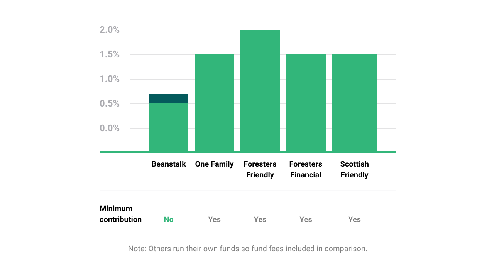

## What is a Junior ISA?

To encourage and help parents and others to put money aside for when their children become adults, the UK Government launched the Junior ISA (“JISA”) in 2011. A JISA is an account held in the child’s name but managed by a parent or legal guardian, and that is usually exempt from both income and capital gains tax. To offer a JISA, the provider, such as Beanstalk, must be approved by HMRC (the UK tax authority).

To comply with HMRC rules, Junior ISAs have a number of features:

* The account is in the child’s name and is only accessible by them once they become 18
* The account can only be set up by a parent or legal guardian who is then responsible for overseeing it until the child is 18. (They are known as the “registered contact”)
* There is a maximum limit for how much can be contributed to JISA accounts in any tax year. For 2020/21, the limit is £9,000.
* Once made, contributions cannot be withdrawn except in a small number of circumstances such as the sad death or terminal illness of a child.
* Different providers operate different rules, but Beanstalk allows contributions to be made by parents or other friends and family, such as grandparents, as well as ourselves as we will directly contribute moneyback earned on your shopping through the app.

There are two types of JISA: “cash” and “stocks & shares” and these are explained in more detail below. A child is only allowed one of each type. You are able to transfer between providers so if you want to open an account of the same type with a new provider, you can if you transfer the old account across. (Beanstalk manages this process for you, we just need the old account details and your signature.)

## What is a Cash JISA?

Cash JISAs are offered by banks and building societies and are like a regular bank savings account in that they typically pay a fixed rate of interest on any savings and the savings are protected under a deposit guarantee system (up to £85,000 per person per bank). Rules vary but some banks require you to open accounts in branch or be an existing customer.

Typically banks offer fixed interest rates (which they vary from time to time). For example, if the bank offers 1% annual interest, then after one year £100 in a JISA would be worth £101. Banks normally set their interest rates considering the “base rate” which is set by the Bank of England and make money by paying savers less interest on their cash than they charge to people who borrow from the bank.

Although cash JISAs give certainty (you know that the savings will grow by the interest rate), one thing to think about is the effect of the inflation rate on the value of your child’s savings. If inflation (the general increase in cost each year of goods and services) is higher than the interest rate, then despite the fact your child’s savings have grown, they will be able to buy less with the money than they could at the start.

## What is a stocks & shares JISA?

A stocks & shares JISA allows you to put money into a range of different investments such as company shares, investment funds and government bonds depending on what the provider offers. The growth in your savings depend on how well the investments do but there is of course a risk that you could end up with less than you put in. However evidence suggests that, over the long term, stocks and shares tend to outperform cash as the returns can compensate for the ups and downs.

For example, the Barclays Equity Gilt Study in 2019 showed that over 50 years, UK shares would have returned 4.7% whereas cash would have returned 1.1%. In some years cash would have significantly outperformed equities but over the longer term it was the other way around.

Beanstalk JISA is a stocks & shares JISA with a simple choice of two tracker funds (an L&G cash fund and a Fidelity global shares fund). Unlike some stocks & shares JISAs, we do not have a minimum one off or monthly contribution requirement to open the account. (It could be opened with savings earned on your shopping).

Stocks & shares JISAs make money by charging various fees on the account. Beanstalk’s only fee is an annual fee of 0.5% on the total balance of the account deducted directly from the account. You can see how this compares to other providers below:

(Note: the tracker funds we offer have their own charges of 0.1% - 0.12% which are deducted through the fund).

PLEASE NOTE: AS WITH ANY INVESTMENT THE VALUE CAN GO DOWN AS WELL AS UP. PAST PERFORMANCE IS NO INDICATOR OF FUTURE PERFORMANCE. THE TAX TREATMENT OF ISAS DEPENDS ON YOUR INDIVIDUAL CIRCUMSTANCES AND MAY BE SUBJECT TO CHANGE IN THE FUTURE.
