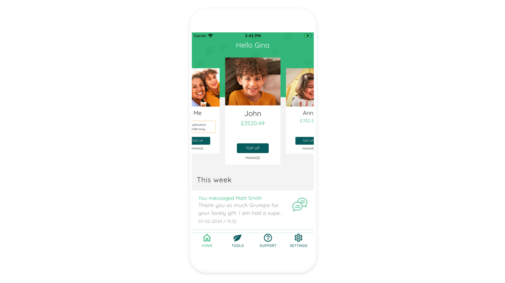

Inviting friends and family to link to your child’s account so they can help out is one of the many unique features that Beanstalk offers. Grandparents, for example, tell us that they really want to support grandchildren by putting money away for when they are older, and they are often in a financial position to be able to do so. Beanstalk makes this really easy for them. Here is how it works:

## How to invite

The place to start is “Invites” under the tools menu. Here you can select which child, or children, you would like the person to link to and then send them an email with your own personal message. We use the email address to track invites so when they download the app and register with that email address (or next log in if they are an existing user), they will be asked if they would like to accept or decline your invite.

If they accept, they will see your child or children listed on the home screen in their app and can then use all the same tools as you (round ups, top ups and so on) to save for your kids. Any contributions they make will be put into your child’s beanstalk account automatically.

You can see how much they have given on the contributors tab. For confidentiality reasons, on their app, they can see what they have given but will not be able to see the total value of your child’s account.

If you want to unlink them, you can also do that through the “Invites” tool.

## Sending messages

Through the app you can swap messages with your children’s contributors. If they make a top up to your child, you will see a message on your app home page to alert you but they can also include a personal message with their gift.

